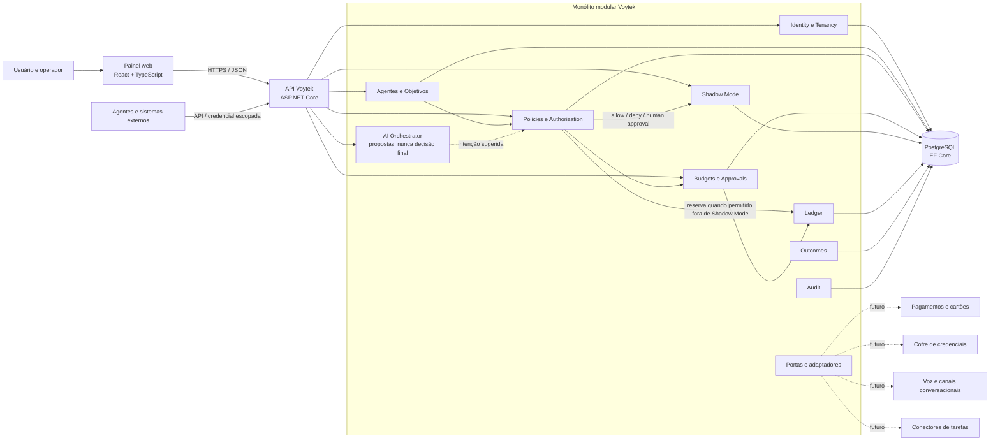

# Arquitetura da Voytek

## Direção do MVP

A arquitetura da imagem inicial foi traduzida para um monólito modular. As caixas continuam representando responsabilidades e limites de domínio, mas não exigem um serviço, banco ou infraestrutura independentes. Assim, o MVP conserva fronteiras que podem evoluir sem pagar agora o custo operacional de uma topologia distribuída.



O banco deve manter os limites de tenant e relacionamentos consistentes. APIs, workers e futuros adaptadores chamam regras/casos de uso do mesmo domínio; não devem duplicar a decisão de autorização.

## Fluxo de uma ação

```text
Agente / LLM propõe intenção
  → Voytek valida identidade, tenant, agente e objetivo
  → motor determinístico avalia status, policy, autonomia e budget
  → ALLOW | DENY | HUMAN_APPROVAL
  → Shadow Mode registra a simulação sem reserva; fora dele, ALLOW reserva o budget lógico
  → ledger e audit preservam a trilha; outcome registra o resultado posteriormente
```

O LLM pode estruturar ou explicar uma proposta, mas não muda políticas, não aprova a própria solicitação e não contorna a decisão do motor. `ALLOW` significa autorizado dentro do modelo lógico atual; não significa pagamento concluído.

## Módulos e fronteiras

| Módulo | Responsabilidade no MVP |
| --- | --- |
| Identity / Tenancy | Usuários, autenticação, memberships, papéis, credenciais de API e isolamento da organização. |
| Agents / Objectives | Identidade, especialidade, autonomia, ciclo de vida, kill switch e missão do agente. |
| Budgets | Limites lógicos, valores reservados/utilizados/disponíveis e vínculo a objetivo. |
| Policies / Authorization | Decisão determinística e explicável: permitir, negar ou solicitar revisão humana. |
| Approvals | Decisão humana registrada; aprovação reserva o valor no budget lógico. |
| Shadow Mode | Avaliação observacional sem executar ações nem reservar saldo. |
| Ledger | Registro de autorizações e reservas internas; não é extrato bancário. |
| Outcomes | Métricas associadas ao agente e objetivo. |
| Audit | Ator, ação, recurso e correlação para reconstruir eventos de governança. |
| AI Orchestrator | Preparação de propostas via `ILLMProvider`; saída continua não executável até passar por autorização. |

Os módulos compartilham a infraestrutura de deploy e persistência no MVP, mas devem evitar acesso casual aos detalhes internos uns dos outros. `Voytek.Domain` mantém invariantes; `Voytek.Infrastructure` implementa armazenamento/adaptadores; `Voytek.Api` valida transporte e identidade da requisição.

## Segurança e confiabilidade

- Todo acesso a dado de organização precisa de contexto de tenant no backend; a interface não é uma barreira de segurança.
- Papéis de gestão controlam mutações; aprovação humana exige uma identidade de usuário, não apenas uma credencial de agente.
- O motor valida estados de agente, objetivo, policy e budget antes da decisão. O kill switch bloqueia novas propostas/ações sensíveis.
- Valores monetários são `decimal` no domínio; a API valida valores positivos e até duas casas na solicitação de autorização.
- `IdempotencyKey` deve repetir a mesma decisão apenas quando o payload é igual; reutilização com conteúdo diferente é conflito.
- Segredos não devem ser incluídos em prompts ou logs. A interface atual não armazena senhas de terceiros.
- Shadow Mode não reserva budget e não executa pagamento. Aprovações fora de Shadow Mode reservam saldo de forma rastreável.
- Integrações externas devem ser idempotentes, registrar correlação e falhar de forma segura antes de ganhar permissão para executar.

## Capacidades futuras: somente fronteiras

Pagamentos, carteira de cartões, Pix/Open Finance, FX, custódia, Voytek Vault, automação completa de SaaS/compras e voz ficam fora do caminho ativo do MVP. As extensões podem ser adicionadas por adaptadores/portas específicas, depois que contratos de parceiro, consentimento, compliance, gestão de segredos, reconciliação e modelo de ameaça forem definidos.

Para voz, a base arquitetural futura seria um canal conversacional que converte fala em uma intenção tipada; essa intenção ainda passa por identidade, políticas, confirmação humana quando aplicável e auditoria. Nenhum modelo de voz, gravação, transcrição ou comando sensível é habilitado neste MVP.

Para Vault, cartões e pagamentos, não se deve criar uma implementação simulada que pareça real. O limite lógico atual de budget/ledger permanece distinto da custódia de dinheiro, dos dados de cartão e do armazenamento de segredos.

## Evolução da topologia

Começar com API, painel e PostgreSQL. Eventos in-process bastam para os fluxos síncronos presentes. Extraia um módulo para processo separado ou adicione fila/cache somente quando houver necessidade mensurável de escala, isolamento de falha ou processamento assíncrono durável. O deploy independente de serviços não é um requisito de qualidade do domínio.
