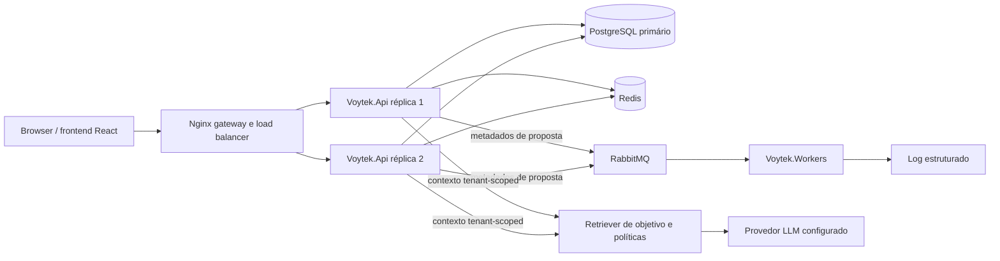

# Arquitetura da Voytek

## O que o software faz

Voytek é uma plataforma SaaS de governança para agentes de IA usados em operações financeiras e de negócio. Uma organização cadastra agentes, objetivos, budgets lógicos e políticas. A API identifica o tenant, avalia as regras e registra `ALLOW`, `DENY` ou `HUMAN_APPROVAL`; o painel React apresenta esses dados. O ledger registra reservas internas de budget, não dinheiro custodiado. Um LLM pode formular uma proposta, mas não autoriza nem executa a ação.

O código atual é um monólito modular .NET 8, um frontend React/TypeScript/Vite e persistência PostgreSQL com EF Core. Os módulos de domínio continuam no mesmo processo e banco. As duas instâncias locais da API são réplicas desse monólito, não microserviços independentes por domínio.

## Topologia local implementada


```mermaid
flowchart LR
    Browser[Browser / frontend React] --> Edge[Nginx gateway e load balancer]
    Edge --> API1[Voytek.Api réplica 1]
    Edge --> API2[Voytek.Api réplica 2]
    API1 --> PG[(PostgreSQL primário)]
    API2 --> PG
    API1 --> Redis[(Redis)]
    API2 --> Redis
    API1 -->|metadados de proposta| MQ[RabbitMQ]
    API2 -->|metadados de proposta| MQ
    MQ --> Worker[Voytek.Workers]
    API1 -->|contexto tenant-scoped| RAG[Retriever de objetivo e políticas]
    API2 -->|contexto tenant-scoped| RAG
    RAG --> LLM[Provedor LLM configurado]
    Worker --> Logs[Log estruturado]
```

- **Nginx (`gateway`)** recebe o tráfego HTTP local e distribui as requisições entre `api-1` e `api-2` usando `least_conn`. Ele faz proxy e roteamento de camada 7; não é um WAF gerenciado nem fornece CDN ou TLS público.
- **Réplicas da API** compartilham PostgreSQL e a mesma configuração JWT. A inicialização usa um advisory lock PostgreSQL para serializar as migrações. O processo não depende de sessão local para autenticar, pois os tokens JWT são validados em cada instância.
- **Redis** armazena por padrão 30 segundos respostas de proposta para solicitações idênticas. A chave é um hash que inclui tenant, agente, modelo, instrução e contexto recuperado. Redis também compartilha o limite de cinco propostas por minuto por usuário/tenant entre réplicas. O cache não participa de autorização, budget, ledger ou escrita financeira; falhas de cache/limitador deixam a API seguir com o limite local por processo.
- **RAG atual** recupera objetivos ativos e políticas ativas do agente dentro do tenant autenticado, pontuando a correspondência lexical com a instrução. O contexto tem limite de tamanho e é enviado ao provedor LLM configurado como referência não confiável. Não há ingestão de documentos, embeddings ou busca vetorial nesta etapa.
- **RabbitMQ e worker** recebem metadados não sensíveis das propostas geradas (provedor, modelo e contagem de tokens), sem instrução, resposta, tenant ou agente. O worker consome e registra o evento; mensagens inválidas vão para uma fila dead-letter. Essa telemetria é best-effort e não é um outbox de eventos de negócio.
- **PostgreSQL** continua sendo a fonte de verdade, mas a configuração local tem apenas um primário e não configura réplicas de leitura ou failover.
- Compose usa um broker RabbitMQ e um worker; não há cluster RabbitMQ, autoscaling, nem consumidor de jobs críticos de negócio.

Suba a topologia com `docker compose up --build` na raiz. A API fica disponível em `http://localhost:8080`; o frontend pode ser iniciado separadamente em `apps/frontend`, conforme o guia de desenvolvimento. Os valores padrão do Compose são exclusivamente para desenvolvimento local. Ambientes compartilhados exigem segredos fortes fornecidos fora do repositório.

## Comparação com `ArquiteturaInicialideia.png`

| Bloco da imagem | Situação neste checkout |
| --- | --- |
| React/TypeScript web | Implementado; o frontend continua separado no desenvolvimento local. |
| CDN e WAF (Cloudflare/Azure) | Ausentes. Nginx local não substitui CDN, proteção DDoS nem WAF. |
| Load balancer e API Gateway | Nginx local recebe tráfego e distribui para duas APIs. Azure Application Gateway, YARP/Ocelot dedicado, TLS público e políticas WAF ainda não estão provisionados. |
| Microserviços por domínio | Domínios continuam no monólito modular. Existem módulos de negócio, mas não processos independentes com bancos e contratos operacionais próprios. |
| Redis | Implementado para cache TTL de propostas de IA e limite compartilhado de propostas por usuário/tenant. Fora do Compose, o cache usa memória e o rate limit distribuído fica inativo; o limitador local da API continua ativo. Não é cache de dados financeiros. |
| Message Broker e Worker | RabbitMQ e consumer implementados para telemetria não crítica de propostas. E-mail/SMS, relatórios e integrações ainda não são jobs ativos. |
| RAG e LLM | OpenAI é o adaptador LLM disponível; o retriever lexical fornece contexto tenant-scoped de objetivos e políticas. Outros provedores, documentos e vetores não estão configurados. |
| PostgreSQL cluster / read replicas | Um PostgreSQL primário local. Sem cluster, failover ou read replicas. |
| Object Storage (Azure Blob/S3) | Há uma porta `IObjectStorage`, mas somente adaptador desabilitado. Nenhum bucket/container é usado pelo fluxo atual. |
| Pagamentos, bancos e Open Finance | Não conectados. Budgets/ledger são lógicos; não há custódia, cartão virtual, pagamento, Pix ou acesso bancário real. |
| Notificações e outros provedores | Interfaces presentes em parte; nenhum provedor de e-mail/SMS/marketplace ativo. |
| Logs, métricas e tracing | Há logs da aplicação e `X-Correlation-ID`; os endpoints de saúde existem. OpenTelemetry, Prometheus/Grafana, ELK/OpenSearch e alertas centralizados não estão configurados. |
| Secrets Vault | Não provisionado. `.env` local é ignorado pelo Git; produção deve usar o gerenciador de segredos da plataforma. |
| CI/CD | GitHub Actions já valida build/testes e há workflows de deploy Azure, mas não provisionam toda a topologia da imagem. |
| Kubernetes / autoscaling | Não provisionado. Compose mantém duas réplicas fixas; não significa autoscaling nem alta disponibilidade de ponta a ponta. |

## Fluxo de proposta assistida por IA

```text
Usuário autenticado no tenant
  -> API valida tenant e agente ativo/sem kill switch
  -> retriever consulta agente, objetivos ativos e políticas ativas desse agente
  -> cache Redis consulta hash exato da instrução + contexto
  -> em cache miss, provedor LLM gera apenas uma proposta
  -> metadados sem conteúdo vão para RabbitMQ (telemetria best-effort)
  -> API devolve a proposta ao usuário
```

Esse fluxo não chama o motor de autorização e não reserva budget. Uma ação real continua precisando passar pelo endpoint de autorização, pelo motor determinístico e, quando aplicável, por aprovação humana. O conteúdo da instrução e o contexto recuperado são enviados ao provedor configurado; não inclua segredos ou credenciais nesses campos.

## Segurança e confiabilidade

- Consultas de objetivos e políticas passam pelo contexto e filtros do tenant na API; o contexto recuperado não contém dados de outros tenants.
- A saída do LLM é consultiva. O prompt instrui o modelo a tratar a instrução e o contexto recuperado como dados não confiáveis; a API não concede ferramentas de execução ao modelo.
- O Redis guarda a saída da proposta por TTL curto. Use rede privada, autenticação e criptografia em trânsito/repouso no ambiente hospedado; não exponha o Redis à internet.
- Eventos RabbitMQ são telemetria não crítica, sem texto de prompt ou saída. Falhas de publicação são registradas e não invalidam a resposta ao usuário. Como não há outbox transacional, esse evento pode ser perdido se o broker estiver indisponível.
- Não publique a porta da API, Redis ou RabbitMQ diretamente em ambientes compartilhados. Exponha somente um edge com TLS, autenticação, regras de rede e proteção DDoS.
- `ALLOW` autoriza dentro do budget lógico da Voytek; não representa pagamento realizado. Shadow Mode simula sem reservar budget.

## Próximas etapas para a arquitetura completa

1. **Gateway de produção:** escolher Azure Application Gateway/Front Door ou Cloudflare, configurar TLS, WAF, DNS, certificados, regras de origem e limites por cliente; manter Nginx somente como perfil local.
2. **Operação resiliente:** provisionar PostgreSQL gerenciado com backup/PITR e failover, Redis gerenciado, política de retenção e alertas; decidir quando réplicas de leitura são necessárias.
3. **Filas de negócio:** definir eventos e garantias de cada fluxo, incluir outbox transacional e consumidores idempotentes antes de mover notificações, relatórios ou tarefas críticas para RabbitMQ/Azure Service Bus.
4. **RAG documental:** escolher fontes permitidas, formatos, retenção, isolamento, embeddings/modelo, banco vetorial e rotina de ingestão antes de adicionar upload de documentos ou vetores financeiros.
5. **Integrações financeiras:** selecionar país, provedor, sandbox, contratos, consentimento, reconciliação, idempotência e requisitos regulatórios para cada integração bancária/pagamento. Só habilitar dinheiro real depois de revisão de segurança e compliance.
6. **Serviços independentes e Kubernetes:** extrair um domínio apenas com limites de dados/contratos estáveis, medir demanda e definir SLOs; então configurar deploy, autoscaling, probes e rollback.
7. **Observabilidade e segredos:** instrumentar OpenTelemetry, exporters, métricas e tracing sem dados financeiros em spans/logs; integrar Key Vault ou o secret manager da plataforma.

Não se deve simular pagamento, Open Finance, cofre de credenciais ou custódia para marcar esses blocos como concluídos. Eles alteram fronteiras de segurança e exigem decisões de produto e provedor.
